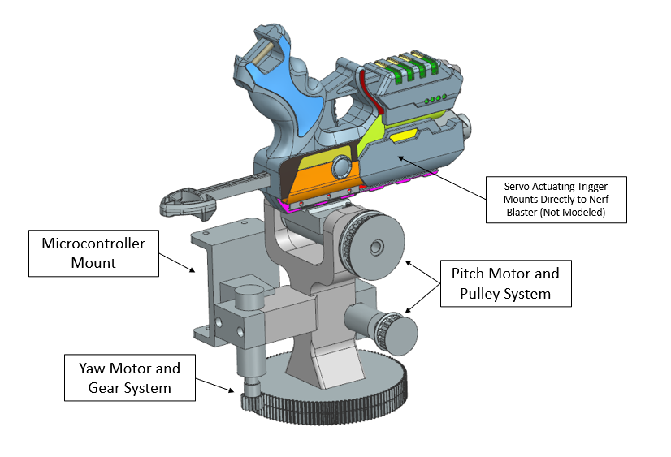

# Introduction

The purpose of this project was to create a "Nerf" launcher system that detects, tracks and launches a nerf projectile autonomously for competition in the Cal Poly ME 405 dueling day.

On the dueling day, teams compete by placing their launchers on opposite sides of a table and pointing 180 degrees away from eachother. This competition requres participants to use a thermal camera and at least one brushed DC motor with an incremental encoder which are provided to each team.On the start signal, lanuchers can be activated and there is a 5 second period where the opposing participants can move around. After 5 seconds, participants must freeze. The scoring system is such that the first hit recieves +3 points, the second team's first hit recieves +1 point, either teams second hit recieves 0 points and a miss revieces -1 points. This scoring system incentives speed (first hit) and reliability (misses recieve negative points).

# Hardware Design

Custom hardware was designed to interface with an off the shelf 'Nerf Elite 2.0 Blaster,' two brushed DC motors with incremental encoders used for yaw and pitch position control and a servo motor used to actuate the trigger mechanism.

Several design concepts were considered including creating our own dart shooting system with compressed air and selecting a more complex 'Nerf' blaster (Nerf Ultra Select) which uses a flywheel to shoot darts and can be electrically actuated. However, we identified concerns with the high mass of these components and inconsistent firing of the flywheel. Based on the competition rules and scoring system, it was determined that a simple, lightweight, single shot blaster actuated by a compressed spring would be able to achieve the speed needed to move quickly and hit our opponents first and the reliability to always fire as expected. Additionally, there was very little incentive to use a multi-shot blaster, as only the first shot in each duel was assigned points. 

An image of our CAD model interfaced with the DC motors and 'Nerf' blaster can be referenced in the figure below.

Additionally, images of our fully integrated model can be referenced below for components not modeled in CAD.

## Yaw Control
The yaw angle of the hardware was controlled via the brushed DC motor with an incremental encoder connected to a gear hard mounted to the table with a 1:8 gear ratio. The system is designed so that the yaw gear is stationary and the entire blaster assembly rotates freely above the large yaw gear. This rotation is achieved by a bearing that is press-fit to both the main rotating bracket and a protruding stub from the main yaw gear. An exploded section view of this bearing assembly is shown below for reference.

## Pitch Control

The pitch angle of the 'Nerf' blaster is achieved by controlling the position of a second brushed DC motor with an incremental encoder. The nerf blaster assembly is rigidly attached to a shaft that is held in place by bearing(s) on either side. The rotation of this shaft is connected to a belt and pulley system which couples the DC motor rotation to the shaft rotation with a 1:1.5 gear ratio. A section view of the pitch control system is shown in the image below. Note: Belt not modeled but connects the pitch motor to the rotating shaft pulley.

## Trigger Mechanism

The blaster trigger was actuated by a medium torque (20 kg-cm) servo motor. This motor was selected as testing of the Nerf Elite 2.0 determined that approximately 30 N of force was required to actuate the trigger. An image of the trigger servo motor mounted to the blaster assembly can be referenced in the figure below.

## Camera Mount and Placement

The camera was placed on the table in front of the blaster, as allowed in the game rules. We did this due to the low resolution of the camera. By having it closer to the target, the target was represented by more pixels than if the camera was placed on the camera. This allowed a more accurate targetting algorithm. Additionally, the camera takes between 500 and 800 ms to take an image, which ruled out the possibility of closed loop feedback with the camera and setpoint for alignment with the target and thus further dissuaded us from a camera mounted to the blaster's axes of rotation. Instead, we opted for a single, clearer image and did open loop positioning calculations based on it.

# Software Design
The software design of the Nerf Sentry Blaster relies on cooperative multitasking. The tasks are broken into a mastermind that controls high level logic and delegation, and a task for yaw, pitch, trigger, and camera operation. More detailed information on the software design is available in the Doxygen Main Page (https://cerlenbo.github.io/ME-405-Term-Project/).

# Testing and Results
Significant time was allocated for full-system integration to ensure proper operation before the duels. Yaw motor function worked relatively smoothly from the start, though there were fundamental issues with the pitch control. Due to the convenience of a mounting rail on the upper rear section of the Nerf blaster, we mounted the Nerf blaster with an asymmetric inertial distribution about its pitch axis. Estimates from CAD found online and rough estimations of center of mass suggested that we would have an appropriate amount of torque for pitch actuation. In the hardware iteration phase, however, the pitch gear ratio had to be reduced to properly fit the drive belt in the absense of a tensioning pulley. This resulted in a condition where if the blaster fell completely forwards, the pitch motor was not strong enough to pull it back up. Due to the accelerated timeline of this project set by the class, we did not have time to order a different blaster or change the drive system to have a higher torque. We also realized that pitch actuation mattered very little, as if a pitch was set that sent a dart about 1 foot above the opponents side of the table, it would always be vertically centered on their bodies. Therefore, we simplified the system by reducing control of the pitch axis to not actuate during the duel.

Another setback occured in the early implementation of the trigger servo. Since there wasn't time to implement a custom PCB with different power levels, we only had 12V from the power supply for the DC motors and the 3V3 and 5V lines of the Nucleo development board. We attempted to power the servo off this line since it was only predicted to need 100-200 mA, but ultimately it required more power than the board was able to supply. This resulted in reset conditions beign triggered in the MCU and led to issues with the trigger task's integration. We fixed this by using a second power supply.

Through testing, we also implemented a limit to maximum yaw rotation to the limits of the table. We found that limiting the yaw set angle between 67700 and 63000 encoder ticks limited the target to each side of the opposing table.

On competition day, we were able to compete against other lab groups in the Tuesday afternoon section. During the first rounds of competition, we tuned the yaw rotation limits and timing of the trigger mechanism for optimal performance, and we ended up with a very reliable system that was able to hit the target more it would miss. This resulted in us going undefeated in duels with other groups and placing first in our sections competition.

# Lessons Learned
Through completing this project there were several lessons learned regarding the mechanical design, project management and implementation of real systems.

Regarding hardware design, we realized the benefit of simplicity. Our relatively simple, lightweight design allowed for quick motion and simplified logic. During the competition we found that our simple design was much more reliable than some of the more complicated mechanisms and was one of the reasons that we placed first in our lab section.

Additionally, being able to quickly prototype our designs allowed time for multiple iterations and full system intergation. For example, we originally decided to make the large main yaw gear out of laser cut wood. However, we found that the laser cutter was unable to accomodate the fine teeth needed without burning the wood. We experimented with other materials like polycarbonate, but we were unable to get a good surface finish. Nonetheless, because we began manufacturing these components weeks before the project deadline, we were able to easily shift to a 3D printed design which provided an excellent surface finish for the fine teeth even though it was a rather long print time. 

Furthermore, we did identify some comcerns with rigidity of the press-fit yaw axis bearing. We found that with fast motions the yaw axis would deflect due to the bearing interface. One way to improve this design would be to have a larger stub protruding from the main yaw gear and two bearings in line to carry this bending momement. We considered remaking these 3D printed parts, but decided to focus on optimizing the current design first. We found that by tuning the controller speed we were able to reduce these rigidity issues and achieve adequate performance. However, if we were to do this again, we would definitely imporve the rigidity of this connection.

As mentioned in the testing and results section, we did experience issues with not having a high enough gear ratio to achieve reliable pitch control. This mistake was likely caused by a misguided intuition on the expected torque from our brushed DC motors as we didn't consider pitch control torque as a high demand. Ultimately, this didn't end up being an issue because there wasn't a need for exact pitch control. However, more detailed high-level planning may have identitifed this issue beforehand and allowed us to select a higher gear ratio for more reliable pitch control.

Finally, regarding project management, we learned the importance of having replacements ready for component integration failure. Even though we followed all safety precautions necessary, we ended up breaking our trigger actuation servo motor during system integration. Although we were able to find a replacement, we would have saved a lot of last minute scrambling if we were to have sourced back up components for the case of a component failure.
