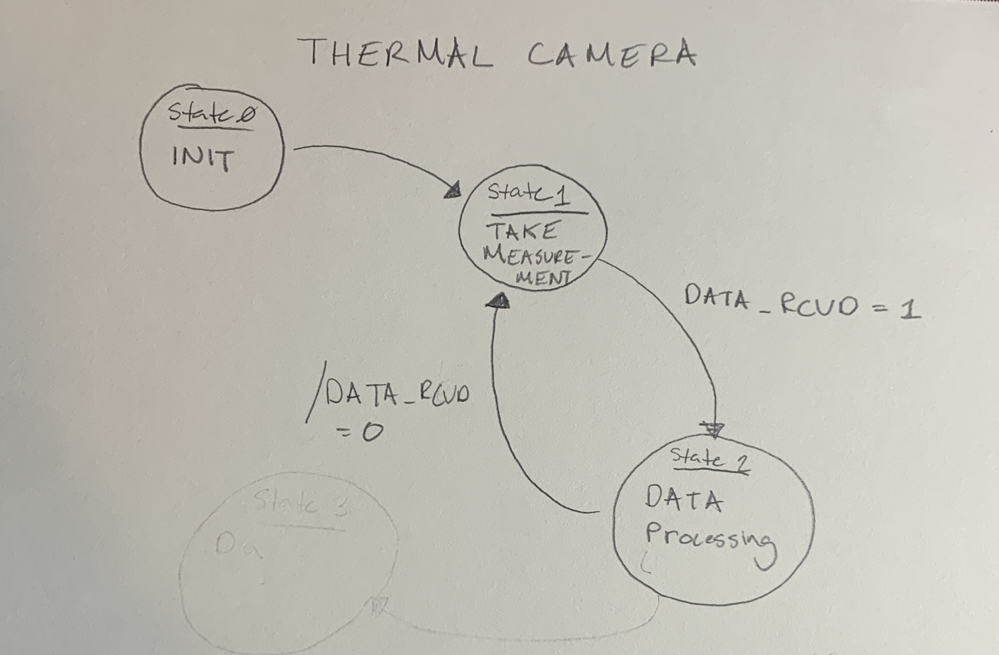

Authors: Caleb Erlenborn and Miles Alderman

A task diagram for our term project design can be referenced below.

A finite state machine for the first task (Read_Camera) can be referenced below.

A finite state machine to perform position control on each DC motor can be referenced below.

Finally a FSM for the trigger actuation system can be referenced below.

