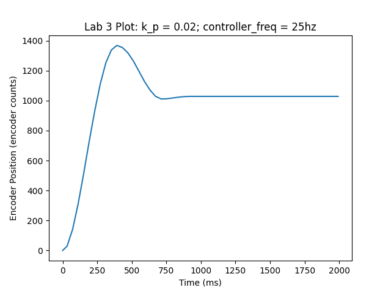

# Lab 3 

Authors: Caleb Erlenborn and Miles Alderman

During this lab, we created and implemented two task functions to perform closed loop position control of two DC motors with encoders. These tasks (motor1_task_fun and motor2_task_fun) are stored in main.py and control DC motors connected to pins INA and INB on the ME 405 lab kit.

At first, we connected a single DC motor and tested the response of the system when the task was run at various frequencies. In the first configuration, we tested the step response of the system with Kp = 0.02 and a task frequency of 100 Hz. The response of this system is plotted below.

After this, we decreased the task frequency of the position control until the performance of the controller was noticeably worse. We found that with a controller frequency of 25 Hz, the controller had an overshoot of ~40% compared to ~25% when run at 100 Hz. Additionally the settling time at 25 Hz was ~1000 ms compared to ~800 ms when run at 100 Hz. Increased settling time and overshoot are undesirable characteristics  of a controller, so we recommend running this task at a frequency greater than 25 Hz to limit these effects. The plot of the step response for the system when run at 25 Hz is shown below.

Finally, we decreased the task frequency of the controller until the system became unstable. We found that at 4 Hz the system became completely unstable and never reached the final desired value. The plot of the unstable system at 4 Hz is shown below for reference.

After characterizing the performance of the system at various task frequencies, we implemented a 2 controller system with a task frequency of 100 Hz. The two controllers were given priority of 1 and 2, respectively. This two motor control system worked very well as both motors performed position control independently and simultaneously.